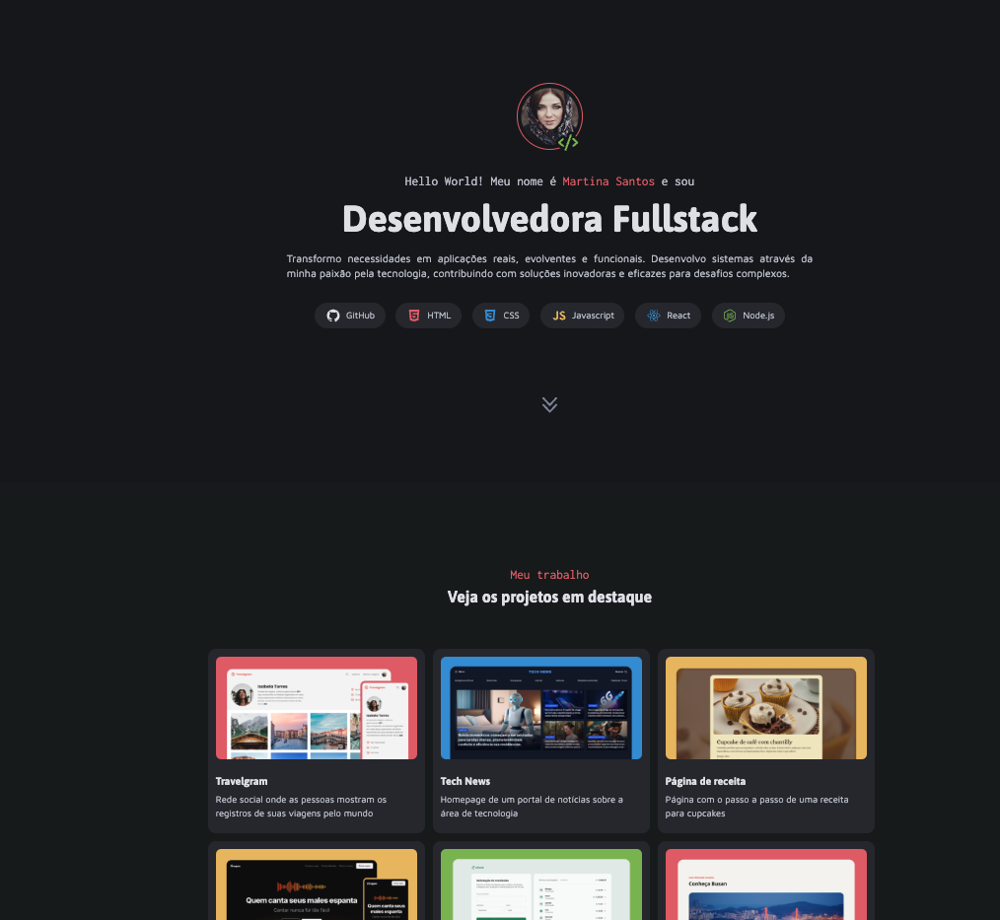

# Martina Santos' Portfolio

This is a professional fullstack developer portfolio, created to showcase my skills, projects, and services. The design focuses on a clear and modern presentation, using **HTML5** and **CSS3** for layout, typography, and responsive design.

🔗 **[Live Preview](https://eugeniobarrosjr.github.io/portfolio/)**

## 📸 Preview

<p align="center">
  
</p>

## 📄 About the Project

This page serves as a digital business card, inviting recruiters and potential clients to explore my work as a Fullstack Developer. The layout is clean and organized, guiding visitors through my skills, featured projects, offered services, and contact information.

### Features

- Clean and responsive layout, adaptable to different screen sizes.
- Semantic and informative content structure.
- Dedicated sections:
  - **Hero**: Initial introduction.
  - **My Work**: Project gallery with descriptions.
  - **My Services**: Details of areas of expertise.
  - **Contact**: Links to social media and email.
- Use of the BEM methodology (Block, Element, Modifier) for CSS organization.
- Custom fonts via Google Fonts for cohesive and pleasant typography.

## 🛠️ Technologies Used

- HTML5
- CSS3
- Google Fonts (Asap, Inconsolata, Maven Pro)

## 📂 How to Run Locally

To view this project locally, follow the steps below:

```bash
# Clone this repository
git clone git@github.com:eugeniobarrosjr/portfolio.git

# Navigate to the project folder
cd portfolio # Or the root folder name of your project

# Open the index.html file in your browser
open index.html
```
